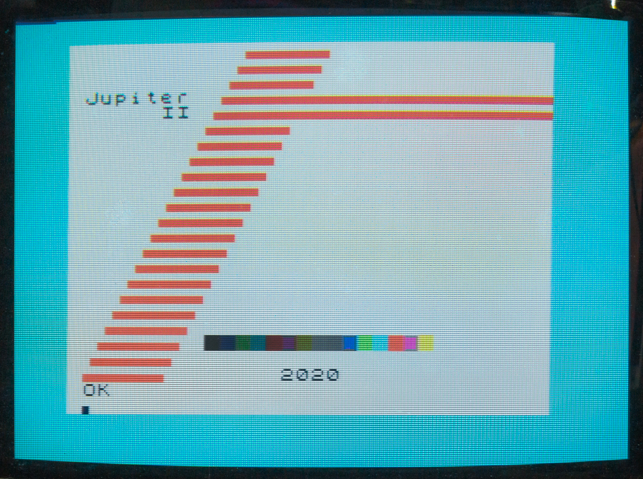

# Jupiter-II Expansion
An Expansion board for the [Jupiter-II](https://github.com/ricaflops/Jupiter-II) computer




## Expands Jupiter-II with
- 16 Color Video and RGB output
- Programmable Sound Generator
- 128K RAM
- 16K ROM
- Serial interface
- Extra FORTH words

## Project status
Hardware validated. Sound, colors and paging working fine.<br/>
Working on FORTH vocabulary extension at reset.<br/>
Next shall start working on serial interfacing.

## FORTH code examples
### Memory Paging
```
0 FONT  ( select alternative character set )
1 FONT  ( select original character set )

0 SCREEN ( select screen page 0 )
1 SCREEN ( select screen page 1 )

0 MPAGE ( select memory page 0 )
3 MPAGE ( select memory page 3 )
```
### Sound
```
: PING
  200 0 PSG!
  254 7 PSG!
  16 8 PSG!
  20 12 PSG!
  1 13 PSG!
;

: SHOT
  8 6 PSG!
  247 7 PSG!
  16 8 PSG!
  20 12 PSG!
  1  13 PSG!
;
```
### Colors
```
CYAN BORDER ( Change screen border color )
WHITE PAPER ( Set char background color )
BLUE DARK INK ( Set char foreground color ) 

: COLORBAR
  CLS 10 8 AT 16 0
  DO
   I INK 144 EMIT
  LOOP 
  BLACK INK
  ;
COLORBAR ( Show a colorfull bar )
```
### Serial Data Transfer
```
4800 BAUD ( Configure UART to 4800 Baud Rate )
15441 526 TX (Transmit 526 bytes starting at address 15441 )
```
# Extra FORTH Words

### Standard words
```
COUNT ( addr -- addr+1 c )  Extract String length
+! ( n addr -- )  Add 'n' to 'addr' variable
? ( addr -- )  Print variable value
CMOVE ( addr1 addr2 n -- )  Copy 'n' bytes from 'addr1' to 'addr2'
FILL  ( addr n c -- )  Fill 'n' bytes with 'c' starting from 'addr'
DEPTH ( -- n )  Data Stack Depth
HEX   ( -- )  Set numeric base to Hexadecimal
```
### Programmable Sound Generator
```
PSG! ( c reg -- ) Write 'c' to PSG register 'reg'
PSG@ ( reg -- c ) Read PSG register 'reg' contents
```
### Memory Paging
```
MPAGE  ( c -- ) Select memory page 'c' , 0 to 3
SCREEN ( c -- ) Select Screen page 'c' , 0 or 1
FONT   ( c -- ) Select character set 'c' , 0 or 1
```
### Serial Communication
```
BAUD ( n --  )  Set UART to Baud rate 'n'
TX ( addr n --  )  Transmit 'n' bytes starting from 'addr' to serial line
RX ( addr n --  )  Receive 'n' bytes from serial line to memory 'addr'
```
### Color
```
BORDER ( c -- ) Set screen BORDER to color 'c' , 0 to 15
INK    ( c -- ) Set character INK to color 'c' , 0 to 15
PAPER  ( c -- ) Set character PAPER to color 'c' , 0 to 15
BLACK  ( -- c ) Stack color code for Black
GREY   ( -- c ) Stack color code for Grey
BLUE   ( -- c ) Stack color code for Blue
GREEN  ( -- c ) Stack color code for Green
CYAN   ( -- c ) Stack color code for Cyan
RED    ( -- c ) Stack color code for Red
PURPLE ( -- c ) Stack color code for Purple
YELLOW ( -- c ) Stack color code for Yellow
WHITE  ( -- c ) Stack color code for White
DARK   ( c1 -- c2 ) Change color code on stack to a darker tone
```
# Technical details

## Memory Paging
```
             Page 0    Page 1    Page 2    Page 3
          +---------+---------+---------+---------+
C000-FFFF |         |         |         | 16K ROM | 49152..65535
          | 32K RAM | 32K RAM | 32K RAM +---------|
8000-BFFF |         |         |         | 16K RAM | 32768..49151
          |---------+---------+---------+---------|
4000-7FFF |          16K RAM (not paged)          | 16384..32767
          |---------------------------------------|
0000-3FFF :        Unexpanded Jupiter-II          : 0..16383
          +---------------------------------------+
```
Note: System resets to page 3 to access expansion ROM immediatly

## Programmable Sound Generator Registers

```
   bits: 76543210 76543210
  R1 R0: ----tttt tttttttt : Tone generator A period (12-bits) 0-4095
  R3 R2: ----tttt tttttttt : Tone generator B period (12-bits) 0-4095
  R5 R4: ----tttt tttttttt : Tone generator C period (12-bits) 0-4095
     R6:          ---ttttt : Noise generator period  (5-bits)  0-31
     R7:          ppnnnABC : I/O port and sound channel enablers
     R8:          ---Mvvvv : Channel A Volume (v) and Envelope Mode (M)
     R9:          ---Mvvvv : Channel B Volume (v) and Envelope Mode (M)
    R10:          ---Mvvvv : Channel C Volume (v) and Envelope Mode (M)
R12 R11: tttttttt tttttttt : Envelope period (16-bits) 0-65535
    R13:          ----calh : Envelope Shape: Continue (c), Attack (a), Alternate(l), Hold (h)
    R14:          dddddddd : I/O Port-A data
    R15:          dddddddd : I/O Port-B data
```
**R0..R6**: Tone and Noise Period (Frequency) settings<br/>

> t = 203125 / f , where f is the desirable frequency in Hz<br/>
> Tone Range: 49.6 Hz to 203.1 kHz (0..4095)<br/>
> Noise Range: 6.55 kHz to 293.1 kHz (0..31)<br/>

**R7**: Tone and Noise Mixer and I/O Ports direction<br/>
> - bit0: when 0 enables tone A on channel A, 1 disables it
> - bit1: when 0 enables tone B on channel B, 1 disables it
> - bit2: when 0 enables tone C on channel C, 1 disables it
> - bit3: when 0 enables Noise on channel A, 1 disables it
> - bit4: when 0 enables Noise on channel B, 1 disables it
> - bit5: when 0 enables Noise on channel C, 1 disables it
> - bit6: when 0 set digital Port-A as input, 1 set it as output
> - bit7: when 0 set digital Port-B as input, 1 set it as output<br/>

**R8..R10**: Channel volume<br/>
> - bit4  : when 0 volume is fixed, when 1 volume is Envelope controlled
> - bit3-0: Fixed volume value (0-31)<br/>

**R11, R12**: Envelope period<br/>

 > t = s / 78.769e-6 , where s is the desirable period in seconds<br/>
 > Period range: 78.8 us to 5.16 seconds<br/>

**R13**: Envelope Shape combination<br/>

> - bit3: Continue: when 1 follows Hold setting, when 0 resets down after one cycle
> - bit2: Attack: when 1 attack ramps up, when 0 ramps down
> - bit1: Alternate: when 1 envelope shape reverses on each cycle (up/down)
> - bit0: Hold: when 1 limits to one cycle and sustain final value<br/>

**R14, R15**: Digital I/O Port data<br/>
> - Port A (register 14) controls PAPER and INK colors
> - Port B (register 15) controls BORDER color and paging<br/>
```
 ______Port A_____    ______Port B_____
| 7 6 5 4 3 2 1 0 |  | 7 6 5 4 3 2 1 0 |
| I R G B I R G B |  | I R G B C S M M |
|  PAPER |  INK   |  | BORDER | Paging |
```
> Color bits: 
> - I=Intensity
> - R=Red
> - G=Green
> - B=Blue components<br/>

> Paging bits:
> - C = Character set 0 or 1 
> - S = Screen page 0 or 1 
> - MM = Memory page 0..3<br/>
