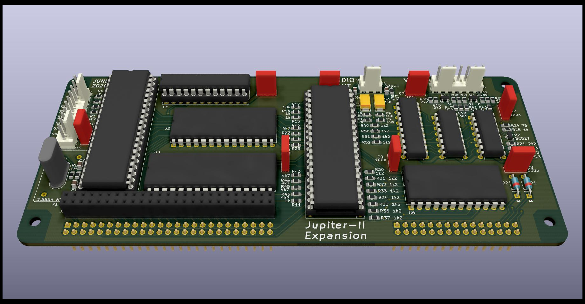

# Jupiter-II-Expansion
Expansion board for Jupiter-II computer

*Important:* Work in progress. initiating hardware tests

## Expands Jupiter-II with:
- 128K RAM memory
- 16K ROM
- RGB video
- Programmable Sound Generator
- UART serial interface
