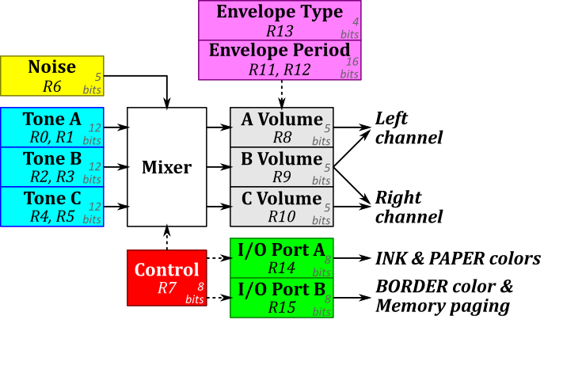

# Jupiter-II-Expansion
An Expansion board for the [Jupiter-II](https://github.com/ricaflops/Jupiter-II) computer


## Expands Jupiter-II with:
- 128K RAM (paged)
- 16K ROM (paged)
- 16 Color Video and RGB output
- Programmable Sound Generator AY-3-8910
- Serial interface (UART)

## Expanded Memory Paging Map
```
             Page 0    Page 1    Page 2    Page 3
          +---------+---------+---------+---------+
C000-FFFF |         |         |         | 16K ROM | 49152..65535
          | 32K RAM | 32K RAM | 32K RAM +---------|
8000-BFFF |         |         |         | 16K RAM | 32768..49151
          |---------+---------+---------+---------|
4000-7FFF |          16K RAM (not paged)          | 16384..32767
          |---------------------------------------|
0000-3FFF :        Unexpanded Jupiter-II          : 0..16383
          +---------------------------------------+
```
Note: System resets to pager 3 allowing expansion ROM to be addressed immediatly
## Important
Work in progress.
The hardware is validated. Sound, Colors and Paging are working fine.
Working in the firmware to expand FORTH vocabulary at reset.
After that shall start looking at serial interface code.

## FORTH code to try
First move RAMTOP down typing:
```
32768 15384 ! QUIT`
```
Then add a small vocabulary to talk to the Programmable Sound Generator
```
: PSG> 253 OUT ; ( register -- )
: PSG! PSG> 255 PSG! ; ( value register -- )
: PSG@ PSG> 255 IN ; ( reg -- value )
```
..and set initial values of PSG I/O ports
```
191 15 PSG! ( PAPER=White, INK=Dark Blue )
241 14 PSG! ( BORDER=Cyan, Memory page=3, Char set=1, Screen page=1 )
192 7 PSG!  ( Enable ports as Outputs )
```
### Sound Examples in FORTH
```
: TONEON
  200 0 PSG!
  254 7 PSG!
  14 8 PSG!
;

: TONEOFF
  255 7 PSG!
;

: PING
  200 0 PSG!
  254 7 PSG!
  16 8 PSG!
  20 12 PSG!
  1 13 PSG!
;

: SHOT
  8 6 PSG!
  247 7 PSG!
  16 8 PSG!
  20 12 PSG!
  1  13 PSG!
;
```
### Screen Colors and Memory Paging in FORTH
```
: INK ( color -- : Set character color )
 15 AND 14 PSG@ 240 AND OR 14 PSG! ;

: PAPER ( color -- : Set character background color )
 15 AND 16 * 14 PSG@ 15 AND OR 14 PSG! ;
 
: BORDER ( color -- : Set screen border color )
 15 AND 16 * 15 PSG@ 15 AND OR 15 PSG! ;

: MPAGE ( page -- : Select Memory page )
 3 AND 15 PSG@ 252 AND OR 15 PSG! ;

( Colors )
 0 CONSTANT BLACK
 8 CONSTANT GREY
 9 CONSTANT BLUE
10 CONSTANT GREEN
11 CONSTANT CYAN
12 CONSTANT RED
13 CONSTANT MAGENTA
14 CONSTANT YELLOW
15 CONSTANT WHITE
: DARK (color -- darkcolor ) 7 AND ;

( Examples )
CYAN BORDER ( Change screen border color )
WHITE PAPER ( Set char background color )
BLUE DARK INK ( Set char foreground color ) 

: A1 ." B D D D D D D D G B G C R M Y W" ;
: A2 ." L B G C R M Y G R L R Y E A E H" ;
: A3 ." A L R Y E A E R E U E A D G L I" ;
: A4 ." C U E A D G L E Y E E N   E L T" ;
: A5 ." K E E N   E L Y     N     N O E" ;
: A6 4 SPACES ." N     N O" 13 SPACES ." T W"  ;
: A7 7 SPACES ." T W" 13 SPACES ." A" ;
: A8 7 SPACES ." A" ;
: RAINBOW
 BLACK BORDER BLACK INK
 CLS
 12 0 DO
  16 0 DO
   I PAPER 2 SPACES
  LOOP
 LOOP
 A1 CR A2 CR
 A3 CR A4 CR
 A5 CR A6 CR
 A7 CR A8 CR
 ;
 
RAINBOW ( Show color bars )
```
## The Programmable Sound Generator Registers

```
   bits: 76543210 76543210
  R1 R0: ----tttt tttttttt : Tone generator A period (12-bits) 0-4095
  R3 R2: ----tttt tttttttt : Tone generator B period (12-bits) 0-4095
  R5 R4: ----tttt tttttttt : Tone generator C period (12-bits) 0-4095
     R6:          ---ttttt : Noise generator period  (5-bits)  0-31
     R7:          ppnnnABC : I/O port and sound channel enablers
     R8:          ---Mvvvv : Channel A Volume (v) and Envelope Mode (M)
     R9:          ---Mvvvv : Channel B Volume (v) and Envelope Mode (M)
    R10:          ---Mvvvv : Channel C Volume (v) and Envelope Mode (M)
R12 R11: tttttttt tttttttt : Envelope period (16-bits) 0-65535
    R13:          ----calh : Envelope Shape: Continue (c), Attack (a), Alternate(l), Hold (h)
    R14:          dddddddd : I/O Port-A data
    R15:          dddddddd : I/O Port-B data
```
**R0..R6**: Tone and Noise Period (Frequency) settings<br/>

> t = 203125 / f , where f is the desirable frequency in Hz<br/>
> Tone Range: 49.6 Hz to 203.1 kHz (0..4095)<br/>
> Noise Range: 6.55 kHz to 293.1 kHz (0..31)<br/>

**R7**: Tone and Noise Mixer and I/O Ports direction<br/>
> - bit0: when 0 enables tone A on channel A, 1 disables it
> - bit1: when 0 enables tone B on channel B, 1 disables it
> - bit2: when 0 enables tone C on channel C, 1 disables it
> - bit3: when 0 enables Noise on channel A, 1 disables it
> - bit4: when 0 enables Noise on channel B, 1 disables it
> - bit5: when 0 enables Noise on channel C, 1 disables it
> - bit6: when 0 set digital Port-A as input, 1 set it as output
> - bit7: when 0 set digital Port-B as input, 1 set it as output<br/>

**R8..R10**: Channel volume<br/>
> - bit4  : when 0 volume is fixed, when 1 volume is Envelope controlled
> - bit3-0: Fixed volume value (0-31)<br/>

**R11, R12**: Envelope period<br/>

 > t = s / 78.769e-6 , where s is the desirable period in seconds<br/>
 > Period range: 78.8 us to 5.16 seconds<br/>

**R13**: Envelope Shape combination<br/>

> - bit3: Continue: when 1 follows Hold setting, when 0 resets down after one cycle
> - bit2: Attack: when 1 attack ramps up, when 0 ramps down
> - bit1: Alternate: when 1 envelope shape reverses on each cycle (up/down)
> - bit0: Hold: when 1 limits to one cycle and sustain final value<br/>

**R14, R15**: Digital I/O Port data<br/>
> - Port A (register 14) controls PAPER and INK colors
> - Port B (register 15) controls BORDER color and paging<br/>
```
 ______Port A_____    ______Port B_____
| 7 6 5 4 3 2 1 0 |  | 7 6 5 4 3 2 1 0 |
| I R G B I R G B |  | I R G B C S M M |
|  PAPER |  INK   |  | BORDER | Paging |
```
> Color bits: 
> - I=Intensity
> - R=Red
> - G=Green
> - B=Blue components<br/>

> Paging bits:
> - C = Character set 0 or 1 
> - S = Screen page 0 or 1 
> - MM = Memory page 0..3<br/>
