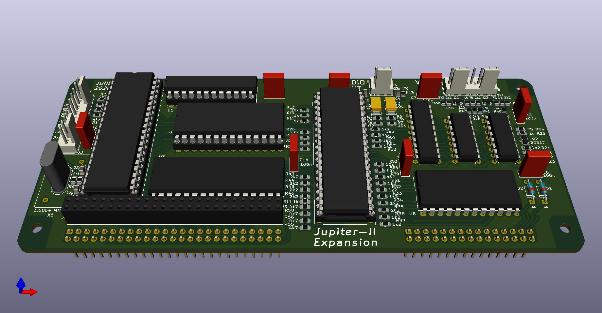

# Jupiter-II-Expansion
An Expansion board for the [Jupiter-II](https://github.com/ricaflops/Jupiter-II) computer

## Important
Work in progress.
Hardware validated. Working in the firmware now.

## Expands Jupiter-II with:
- 128K RAM memory
- 16K ROM
- RGB video
- Programmable Sound Generator
- UART serial interface
